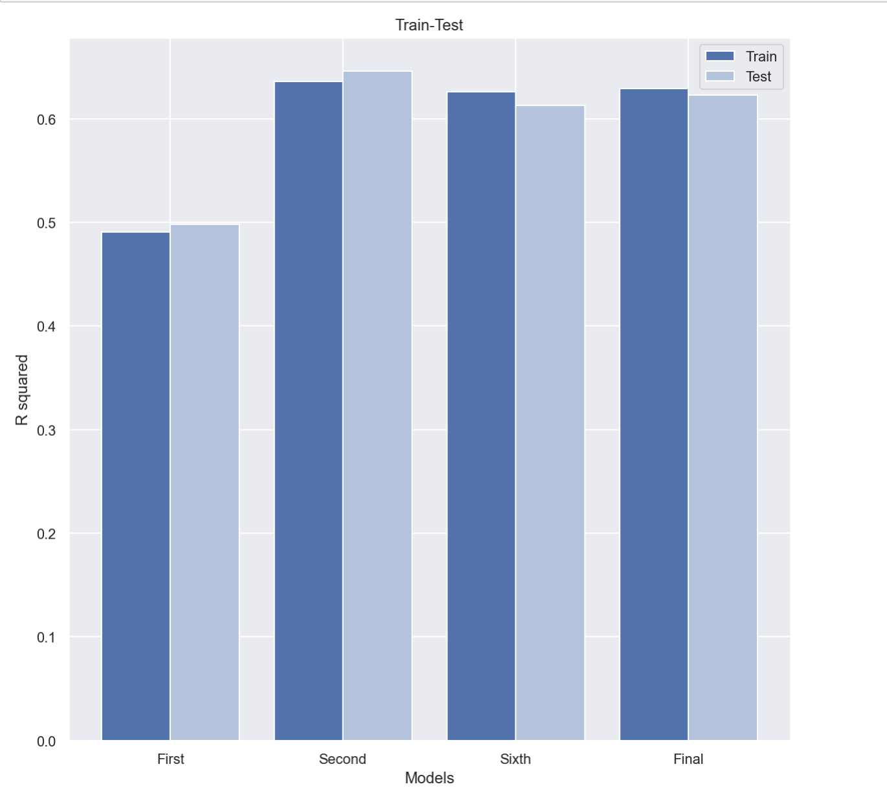

# King County Housing  Project

## Table of Contents
* [Business Understanding](#business-understanding)
* [Data Understanding and Preparation](#data-understanding-and-preparation)
* [Methods](#methods)
* [Modeling](#modeling)
* [Checking for Assumptions](#checking-for-assumptions)
* [Conclusion](#conclusion)

## Business Understanding

We have been approached by an investor wants to invest real estate business about how to accurately appraise homes in Kings County so that they can have idea about home prices it comes to buying and selling homes. We've been given a data set that contains various information about the different homes within Kings County. In this study,we hope to highlight the features available to us in the data that were the most indicative of a property's sale and buy prices.

The highly correlated predictors were determined from the dataset. All assumptions of the multile linear regression were checked, and an optimal final model was achieved by keeping the most influential features only. Based on the multiple linear regression model `grade`, `sqft living area`,`floors`,`sqft_living15` and `bathrooms` were found to be important features that drive the overall sale price of a house in King County.

## Data Understanding and Preparation

The data provided to us consist of information pertaining to over 20,000 house sales carried out between 2014 and 2015, located in the data/kc_house_data.csv file in this repository.data dictionary summarizing the information contained in each of the 20 relevant features.

Nearly all practical datasets will contain null values. However, only three columns had missing values to be converted.

* `view` - Quality of view from house
* `waterfront` - whether the house was located next to a body of water
* `yr_renovated` - the year a house was renovated (if it ever had been)

In each of these cases, we found it appropriate to fill these columns with their modes, which represented the overwhelming majority of values pertaining to each feature (most houses hadn't been viewed, most were not waterfront properties, etc.)

## Methods

We started with inspecting and cleaning the datasets by  checking for the type of data and missing values. Further conducted Exploratory Data Analysis (EDA) and removed nonimportant features based on EDA. Then built multiple linear regression models in OLS statsmodels to determine our strongest correlations. We evaluated each model by checking multicollinearity among different features and then returned to the data to see what could to be changed and  removed outliers to  capture successful model.

## Modeling 
### Final Model

For optimal final inferential model I tried keep the most influential predictors only. However, our model is not perfect. Its coefficient of determination: R-squared is 0.628. Since we are working with real-world data that is inherently noisy, this is not a bad value.

## Checking for Assumptions

- sqft_living is corraleted with target
- residuals are somewhat homoskedastic

- Grade is corraleted with target,
- Residuals are somewhat homoskedastic

-The `floors`,`bathrooms`,`sqft_living15` variables are not homoscedastic by the graphs above meaning the variance decrease as the independent variable gets bigger

## Conclusion

### Interpreting Regression Coefficients

After analyzing this King County data, our final model would suggest the main factors in increasing property value to be it’s grade , bathrooms , sqft_living of the property as well as sqft_living15 and floors.

The sign of a regression coefficient indicates whether there is a positive or negative correlation between each independent variable and the dependent variable in the model. A positive coefficient indicates that as the value of the independent variable increases, the mean of the dependent variable also tends to increase.

Thus when we `increase` the features with `one unit` the price will `increase` in the following way:

- grade: `+20.27%`
- sqft_living: `+14.50%`
- bathrooms: `+8.87%`
- floors: `+8.36%`

And also when we `increase` the features with `one unit` the price will `decrease` in the following way:

- bedrooms: `-3,42%`
- sqft_lot15: `-7.33%`

Suprisingly I had bedrooms has negatif coefficient. it might be because of bathroom and bedroom are interacting features.

### Interpreting RMSE values

This is a healthy looking difference between our Train and Test scores.On final model the Train score is slightly higher, we can identify that our model is slightly overfit. But the difference between the two scores does not seem too high so our model seems to be able to be more general/holistic in its inference based on its performance with the test data.

The RMSE is a measure for how "wrong" a regression model's predictions are on average, and is mostly useful as a relative metric for determining which of a set of models is best.

On our final model we got 0.31 RMSE value which is more meaningful error measure is root mean square logarithmic error, which is the RMSE after taking the log of 𝑦 value. The reason for this is that we're interested in errors as proportions of our target (an error of 50,000 is much more serious for 100,000 house compared to a $1,000,000 house) and taking logs is the way to adjust for this.

in this case we can say that 0.31 shows that the model can relatively predict the data accurately.

Our final models R squared was 63% with an RMSE of 0.3. Linear regression was probably not the best tool to use to get the most out of this data set so in the future we would like to use different more powerful machine learning tools in order to make this a more accurate inferential model.

### Recommendations

- Grade is referring to the classification based on a structures construction quality. This mainly has to do with the types of materials used and the quality of the work done. Trying to get at least grade 8 which is an average in construction and design according to the King County Department of Assessment. It can be achieved by using better materials in both the exterior and interior finishes. As grade increases, the house price tends to be grow.

- Most preferable house floor(levels) can be reached up to 2.5 in order to stay increased in price. Houses with floors(levels) between 3-3.5 are not desirable since prices getting sharply decreasing.

- Increasing the square footage of the living area along with the square footage of interior housing living space for the nearest 15 neighbors will also tend positively effects the price increase

- Renovating house impacts positively its value.

### Next Step

Based on the adjusted R-squared we got more than 35% of the variance in housing prices cannot be explained by the selected principal components.In Future analysis I would like to add more features such house locations, demographics , security of a neighborhood etc to our regression model.

Also I would like to apply machine learning tools on future home sales to find a better fit model.

